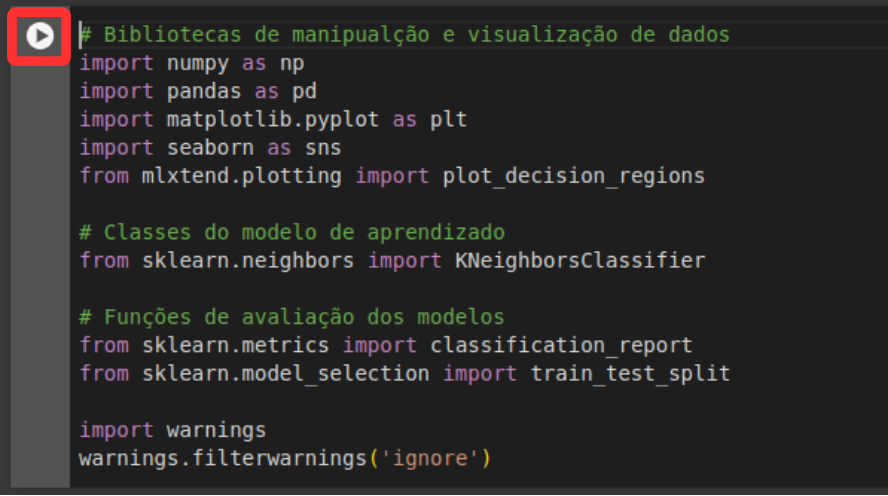

# Monitoria Aprendizagem de Máquina I (Embraer)

Oi! Seja bem-vind@ ao nosso repositório da disciplina "Aprendizagem de Máquina I"!

Aqui, você encontrará todo o material das atividades práticas.

Para essas atividades, vamos usar o Google Colab, uma plataforma simples de executar códigos em Python.
O Colab vem com bibliotecas pré-instaladas e permite que a gente utilize GPUs do Google!

## Utilizando Google Colab

1. Primeiro, entre em https://colab.research.google.com . Após o login, são exibidos os notebooks mais recentes que você abriu.

2. Clique na aba GitHub e insira o link do repositório https://github.com/johnattandouglas/monitoria-ml. Após isso, todos os notebooks no repositório ficarão visíveis e você poderá abrí-los em uma nova guia.

3. Finalmente, com o notebook aberto, você poderá programar e executá-lo!
Para garantir que todas as variáveis estarão configuradas, clique na aba _Ambiente de execução_ e clique em _Executar tudo_. Um notebook é composto por duas células base, uma célula _markdown_ e uma célula de código. As células _markdown_ são células que contém texto. Além de texto, equações no formato LaTeX também podem ser inseridas. Já nas células de código, você pode executar os trechos de código em python de forma isolada.

    
4. Para executar uma célula de código, mantenha o mouse em cima da célula e clique no botão que aparecer no canto superior esquerdo da célula, ou clique na célula e aperte _ctrl+enter_. Se houver algum resultado para ser mostrado na tela, ele será mostrado abaixo.

## Nota
É recomendado fazer uma cópia no Google Drive para conseguir salvar as alterações nos arquivos. Isso é super fácil!

Basta abrir o notebook no Colab e selecionar _Arquivo_ > _Salvar uma cópia no Drive_.

Assim, você terá uma versão própria para editar à vontade.

## Executando Notebooks

Os códigos são disponibilzidos no formato .ipynb,  que significa "IPython Notebook" (ou simplesmente "notebook"). Dessa forma, você pode executá-los em diversos ambientes que suportam esse formato, como Jupyter Notebook, Visual Studio Code, entre outros.

Todas as bibliotecas e pacotes que são pré-requisitos para execução estão listados no arquivo _requirements.txt_ .

Para instalar os pacotes, execute o seguinte comando no prompt de comando ou terminal da sua ferramenta:

`pip install -r requirements.txt`

Qualquer dúvida, estou à disposição!

Abraços,

[Johnattan](mailto:jdfv@cin.ufpe.br?subject=Dúvida%20AM%20Embraer)